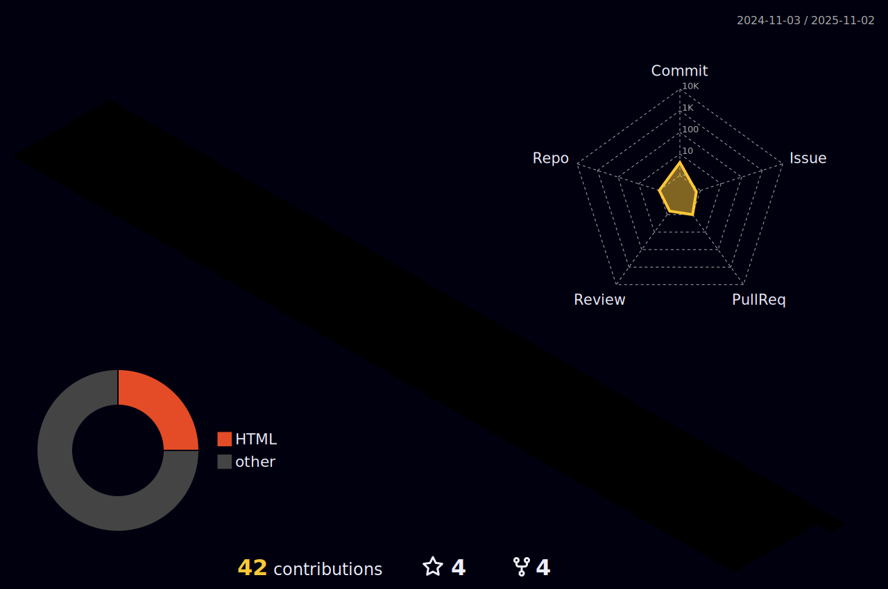

 

    <h1> Hi there, I'm Shoaib Sabir 👋<a href="#"></h1>
  

  

## 🐛Github Magic Game

 

 

#   About Me:

I'm a Rails Developer, Teacher and Researcher!
- 🔭 I’m currently working as Backend Engineer.
- 🌱 I’m currently expanding my knowledge in MERN, low level programing and devOps.
- 👯 I’m looking to collaborate with other content creators and developers.
- 📢 Love to teach and inspire students.
- 🥅 2024-29 Goals: Contribute more to Open Source projects and Execute my Innovative ideas.
- 💎 If you are a Tech boy/girl let's get connected

 

<h2>Tech Stack</h2>

<table width="80%">
<tr>
    <td align='center' width="150">
        
    </td>

  <td align='center' width="150">
        
    </td>
 <td align='center' width="150">
        
    </td>
 <td align='center' width="200">
        
    </td>
 <td align='center' width="200">
        
    </td>
 
</tr>
 
<tr>
    <td align='center' width="200">
        
    </td>
    <td align='center' width="200">
        
    </td>
 <td align='center' width="200">
        
    </td>
     <td align='center' width="200">
        
    </td>
    <td align='center' width="200">
        
    </td>
</tr>
 
<tr>
    <td align='center' width="200">
        
    </td>
    <td align='center' width="200">
        
    </td>
 <td align='center' width="200">
        
    </td>
  <td align='center' width="200">
        
    </td>
    <td align='center' width="200">
        
    </td>
</tr>
	
<tr>
    <td align='center' width="200">
        
    </td>
    <td align='center' width="200">
        
    </td>
 <td align='center' width="200">
        
    </td>
     <td align='center' width="200">
        
    </td>
    <td align='center' width="200">
        
    </td>
</tr>
    
</table>

|Stats />|Streak />|Languages />
|---|---|---|
||||
 
 ## Personal Projects

| Project :octocat:                                                                | Issues :bug:                                                                                                                                                                             | Open PRs :bell:                                                                                                                                                             | Closed PRs :fire:                                                                                                                                                                                                       | Last Commit 🚩                                                                                                                                                                                      |
| -------------------------------------------------------------------------------- | ---------------------------------------------------------------------------------------------------------------------------------------------------------------------------------------- | --------------------------------------------------------------------------------------------------------------------------------------------------------------------------- | ----------------------------------------------------------------------------------------------------------------------------------------------------------------------------------------------------------------------- | --------------------------------------------------------------------------------------------------------------------------------------------------------------------------------------------------- |
| [**Leetcode Practice**](https://github.com/Shoaib19/Leetcode)                  |                            |                            |                            |                            |
| [**Github Profile**](https://github.com/Shoaib19/Shoaib19)                   |                        |                        |                        |                        |
| [**Devicon**](https://github.com/Shoaib19/devicon) |  |  |  |  |
| [**MyBlogs**](https://github.com/Shoaib19/tech-blogs)    |        |        |      |        |

## ⚡️Github Contributions
	
<h4 align="center">Isometric view of contributions in the last year</h4>

	

## 🚀Github Metrics

	

 
 

 

 
  Views 
  

